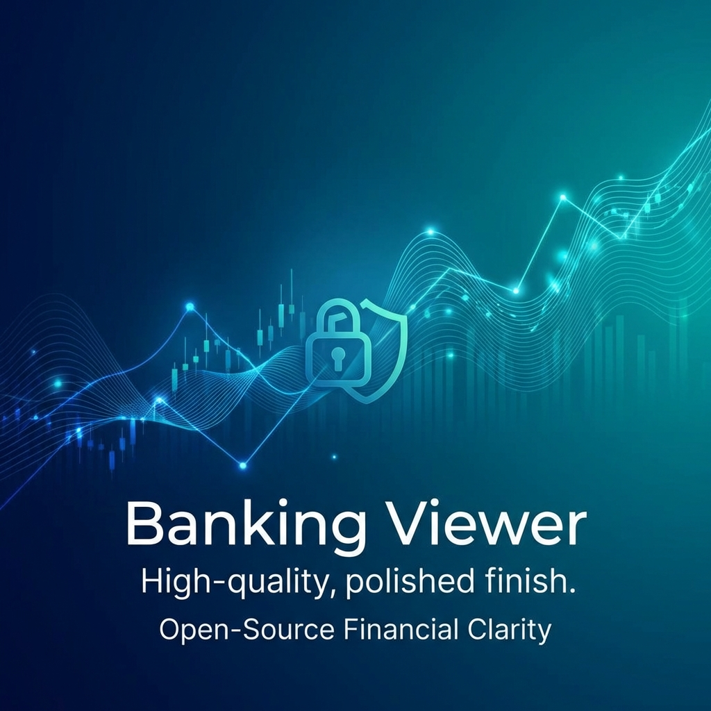

<p align="center">
  
</p>

<h1 align="center">Banking Viewer</h1>

<p align="center">
  <strong>The private-first, open-source financial dashboard for complete data autonomy.</strong>
</p>

<p align="center">
  
  
  
  
</p>

---

## 🔒 Why Banking Viewer?

In an era where financial data is treated as a commodity, **Banking Viewer** puts you back in control. Most financial apps require you to link your bank accounts to third-party servers, exposing your most sensitive data to potential breaches and corporate tracking.

**Banking Viewer is different.**

### 🏛️ Your Data, Your Fortress
- **Zero Backend**: There is no server. No database in the cloud. No "secure vault" on someone else's computer.
- **Local-Only**: Your financial data never leaves your machine. The app runs entirely in your browser or as a local Electron desktop application.
- **Privacy by Design**: We don't collect telemetry. We don't track your spending habits. We don't even know you're using the app.
- **Open Source**: Trust is earned, not given. Our entire codebase is open for audit, ensuring what we say is what we do.

---

## 🚀 Features

- **Intuitive Dashboard**: A bird's-eye view of your financial health.
- **Financial Forecasting**: Project your liquidity and future balance with ease.
- **Recurring Transaction Detection**: Automatically identify subscriptions and fixed costs.
- **CSV Support**: Import data from your bank's exports without ever needing an API key.
- **Fast & Lightweight**: Built with React, TypeScript, and Vite for a sub-second response time.

---

## 🛠️ Installation

Ready to take control of your finances? Follow these simple steps to install Banking Viewer on your desktop.

### macOS & Windows

1.  **Download**: Head over to our [GitHub Releases](https://github.com/mmonteiroc/BankingViewer/releases) page.
2.  **Select Version**: Find the latest version and download the installer for your platform:
    *   **macOS**: `.dmg` or `.zip` file.
    *   **Windows**: `.exe` (NSIS) or `.msi` installer.
3.  **Install**: 
    *   On **macOS**, open the `.dmg` and drag Banking Viewer to your Applications folder.
    *   On **Windows**, run the `.exe` and follow the setup wizard.
4.  **Launch**: Open the app and start importing your bank CSVs. Everything remains local.

---

## 🗺️ Roadmap

We are just getting started. Our vision is to become the universal interface for personal finance.

- [ ] **Multi-Bank Support**: Streamlined import formats for major banks worldwide.
- [ ] **Advanced Tagging**: Auto-categorization using local-first heuristics.
- [ ] **Encryption at Rest**: Optional AES-256 encryption for your local data files.
- [ ] **Mobile Wrapper**: A companion mobile app that also respects your privacy.

---

---

## 📖 Documentation

For more detailed information on specific features and technical implementation, check out our internal documentation:

- [Features Documentation](FEATURES_DOCUMENTATION.md) - Deep dive into core functionalities.
- [Implementation Summary](IMPLEMENTATION_SUMMARY.md) - Overview of the architecture and design decisions.
- [Liquidity Forecast Improvements](LIQUIDITY_FORECAST_IMPROVEMENTS.md) - Details on the forecasting engine.

---

## 💻 Development

Want to contribute or build from source?

### Prerequisites
- Node.js (Latest LTS recommended)
- npm

### Setup
```bash
# Clone the repository
git clone https://github.com/mmonteiroc/BankingViewer.git

# Install dependencies
npm install

# Run in development mode
npm run electron:dev
```

### Building the app
```bash
# Build for production
npm run electron:build
```

---

## 📄 License

Distributed under the MIT License. See `LICENSE` for more information.

---

<p align="center">
  Built with ❤️ for financial freedom.
</p>
